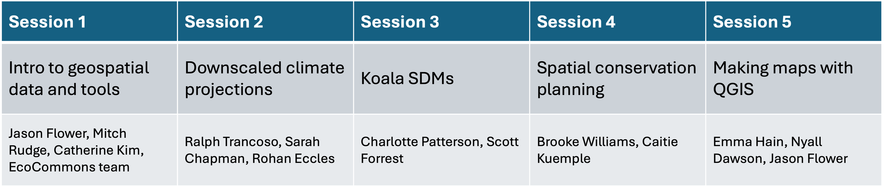

# ICCB Workshop - Open Source Geospatial Tools for Conservation under Climate Change

This repo contains the materials for the ICCB workshop titled "Open Source Geospatial Tools for Conservation under Climate Change", and can be viewed as the Quarto/GitHub pages site at https://geospatial-community.github.io/ICCB_geospatial_tools_conservation/.

Sessions include:

-   Intro to to geospatial data and tools
-   Downscaled climate projections
-   Koala species distribution modeling
-   Spatial conservation planning
-   Making maps with QGIS

