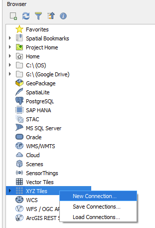
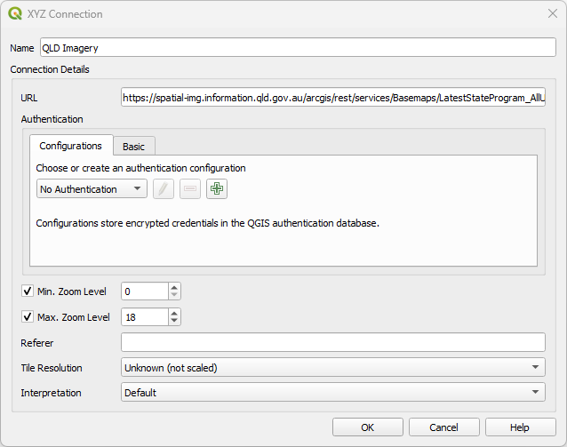

# Prior to the Course

[Download QGIS 3.40.7](https://qgis.org/download/) (current Long Term Release) using the [OSGeo4W installer](https://qgis.org/resources/installation-guide/#online-osgeo4w-installer)

## Download data

[📁 Download ZIP: Course materials](https://raw.githubusercontent.com/EmHain8/QGIS-Cartography-ICCB/main/data/data.zip)

## For those new to QGIS

Prior to the conference, you can undertake the freely available [Introduction to QGIS](https://courses.spatialthoughts.com/introduction-to-qgis.html) from Spatial Thoughts.

We will be using the following facets of QGIS, so familiarise yourself with them:

\- [Load layers](https://docs.qgis.org/3.40/en/docs/user_manual/managing_data_source/opening_data.html#loading-a-layer-from-a-file0)

\- [Navigating around the map](https://docs.qgis.org/3.40/en/docs/user_manual/introduction/qgis_gui.html#view)

\- [Status bar information](https://docs.qgis.org/3.40/en/docs/user_manual/introduction/qgis_gui.html#status-bar)

\- Panels: [Layers](https://docs.qgis.org/3.40/en/docs/user_manual/introduction/general_tools.html#label-legend), [Browser](https://docs.qgis.org/3.40/en/docs/user_manual/introduction/browser.html), [Layer Styling](https://docs.qgis.org/3.40/en/docs/user_manual/introduction/general_tools.html#layer-styling-panel), [Identify Results](https://docs.qgis.org/3.40/en/docs/user_manual/introduction/general_tools.html#identify), [Processsing](https://docs.qgis.org/3.40/en/docs/user_manual/processing/toolbox.html#processing-toolbox0)

\- [Working with project files](https://docs.qgis.org/3.40/en/docs/user_manual/introduction/project_files.html)

\- [Attributes toolbar](https://docs.qgis.org/3.40/en/docs/user_manual/working_with_vector/attribute_table.html#introducing-the-attribute-table-interface)

\- [Print layout](https://docs.qgis.org/3.40/en/docs/user_manual/print_composer/overview_composer.html)

\- [Atlas](https://docs.qgis.org/3.40/en/docs/user_manual/print_composer/overview_composer.html#atlas-menu)

# Workshop Set-up

## Create a project file structure

Create this somewhere logical:\

## Open QGIS

Save the project file to Products and name it `ICCB_Koala.qgz`

## Install Data Services

Load the following XYZ Tiles:\
**QLD Imagery**\
https://spatial-img.information.qld.gov.au/arcgis/rest/services/Basemaps/LatestStateProgram_AllUsers/ImageServer/tile/%7Bz%7D/%7By%7D/%7Bx%7D

Load the following ArcGIS REST Server:\
**QLD**\
https://spatial-gis.information.qld.gov.au/arcgis/rest/services

### How to load a connection

*This works for both the XYZ Tile and the ArcGIS REST Server.*\
1. In the `Browser` panel, right mouse click and select `New Connection`\
\
2. Give the Connection a name\
3. Enter in links from the website into the URL\
4. Click OK\

