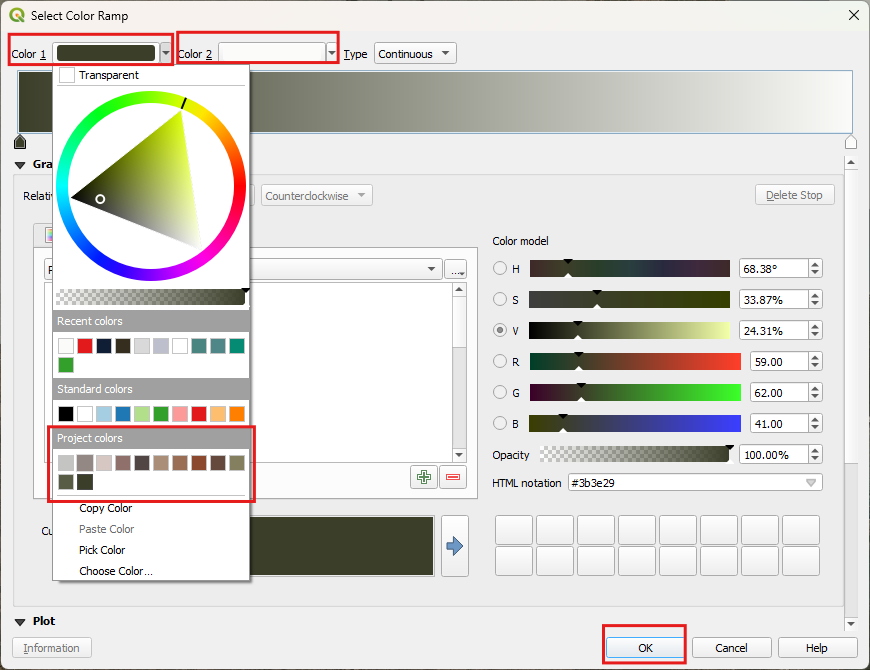
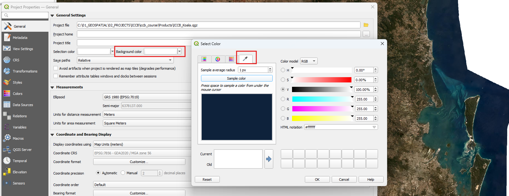

## Loading data
Loading data can occur in multiple ways. For this course, we will use the Browser and the Data Source Manager.  

One of the important aspects to an efficient mapping product, is keeping it tidy. A way to do this is to create `Groups` in the `Layers` panel.   

  
> - Create the above groups in the layers panel by right mouse clicking in the layer panel and selecting `Add group`.  
>   

### Browser
Accessing the data via the `Browser` panel, we will add the data to the groups. 
> - Ensure you have the `Browser` panel open.  
>   
> - At the top of the `Browser`, click on the arrow next to `Project Home` to expand it  
>   
> - Expand the Data folder  

We are going to select multiple files and load them under the group headings 
> - First, in the `Layers` panel, click on the group 'Original data'  
>   
> - Then head over to the `Browser` panel and expand the data folder.  
We want to select multiple files and load them into the 'Original data' group. We can do this by holding down the ctrl key whilst clicking on multiple the files.
> - Hold down the `ctrl`key, and click on the following files
>   - 'current_distribution_RF_1.tif'  
>   - Expand the geopackage and click on all the layers*  
> - With all of these selected, click on the `Add selected layer` button at the top of the `Browser` panel  
>   
> - This results in layers nested under the 'Original data' group  
>   
> - Turn off the layers, population_centres and watercourse  
> - **Save your project**  

*N.B. The layers in the geopackage have been extracted from the ArcGIS REST Service from the Queensland Government. Refer to [Ref A - Add Data](https://emhain8.github.io./QGIS-Cartography-ICCB/docs/part1a-add-data.html) for step by step instructions for other methods.*   

Nearly there with the data, we just need to add in a basemap.  
> - In the `Layers` panel, click on the group 'Base'  
> - In the `Browser`, under `XYZ Tiles`, click on 'Qld Imagery'  
> - Click on the `Add selected layer` button at the top of the `Browser` panel

Next, we are going to add in the picture of the Koala. We are doing this as we want to be a little bit clever for some tricks later on. Usually we would just add the picture to the Print Layout. 
> - In the `Layers` panel, click on the group 'Decorations'
> - In the `Browser`, under the 'Data' folder, click on koala_1.jpeg
> - Click on the `Add selected layer` button at the top of the `Browser` panel
> - **Save your project**  

## Styling
Now it is time to style the:  
- Koala distribution: 'current_distribution_RF_1.tif'  
- LGA: local_government_area  
- Mask: seq_boundary  

### Create a Palette
We all consume branding everyday and choosing a palette of colors is a part of it. Artists will also look to a set of colors, a palette, to help harmonise their work. So let's create a palette from the Koala picture you have.  
> - In the `Layers` panel, expand the 'Decorations' group  
> - Right mouse click on the 'koala_1.jpeg'and click on `Zoom to layers`  
> - On the top menu, click on `Settings > Options'  
> - In the `Options`, select `Colors` on the left side  
>    
> - Click on the drop down where it says *Standard colors* and select *Project colors*  
> - Click on the green plus button to bring up the `Select color` dialog
>   
> - Click on the `Sampling`tab  
> - To start collecting the colors for the palette click the `Sample color`button  
> - Let's start with a light grey first, so click the background of the koala image to pick up the grey and click `OK`  
> 
> - **Save your project**  

The grey now appears in the palette. you can change the label it you want. Repeat the above to capture the following:
- Browns from the trunk
- Greens from the leaves
- Greys from the fur and nose
- Pinks from the fur
>   
> - click `OK`  
> - **Save your project**  

These project colors are now built into this project file. They will appear when you go to the palette option to select colors. 

### AOI Map
First, we are going to create our "AOI" map - our area of interest. For this we will want the following datasets turned on:  
- Mask: seq_boundary  
- LGA: local_government_area  
- Qld Imagery

#### Create the Mask
> - Under 'Original data' turn on the layer seq_boundary and zoom to it (right mouse click)
> - Right mouse click on it and select `Duplicate Layer`  
> - Move this layer to the sit under the 'Mask' group  
> - Rename it to AOI (right mouse click > `Rename Layer`) and click on it so it becomes the `Active` layer  
> - Right mouse click anywhere in a blank area on the toolbar at the top and select `Panels > Layer Styling Panel`  
>   
> - In the `Layer Styling` panel, select from the drop down `Inverted Polygons'  
> - Click on `Simple Fill` and remove the outline and change the colour to white  
> 
> - **Save your project**  

This is the mask we want for the 'Island' look for the Grid data, but for the AOI, we want to still see the surrounds so it helps us get our bearings. To do this, we are going to create an additional style for the AOI layer.  

> - Right mouse click on the AOI Layer and click `Styles > Add`. Call this 'AOI'   
>   
> - In the Layers Styling panel, click on the Simple Fill and change it to `Shapeburst Fill`

The `Shapeburst Fill` is a great effect and can also be used for styling water bodies. But we are going to create a transparent mask so we can still see the aerial image under it 
> - For the `Gradient Colours` select the `Colour ramp` option and click in the color bar to bring up our options.  
>   

We are going to use the greens from our `Project colors` palette  
> - For Color 1, select the darkest green you have  
> - For Color 2, select white  
> - Click ok
>   
> - **Save your project**  

Last step for this AOI, we want to make it transparent.  
> - In `Layer Styling`, at the bottom, expand the `Lyaer Rendering` options  
> - Nect to `Opacity` click in the percentage field and make it 66%  
>    

As you can see here, the QLD Imagery does not extend into the Coral Sea enough, so this is where we may have to replace it with another service. Ensure you have the rights to use it. An easy fix it to set the map property background colour to that of the sea. 

Let's sort out our LGA's now with boundaries and some labels.  
**Boundaries**  
> - Under 'Original data' duplicate 'local_government_area' and move the dupe into the 'Context data' group
> - Rename it 'LGA'
> - In the `Layer Styling`, click on `Simple Fill` and change the outline to a light grey (#d9d9d9)

**Labels**
> - In the `Layer Styling`, click on the label tab  
>   
> - Select from the dropdown `Single Labels`  
> - For the value, select 'abbrev_name'  
> - Select the font 'Roboto Black', size 6  
> - For the color, select the same color as the outline - this should be on the palette  
> - Click on the next tab and add in Multiple lines based on spacing  
> - Add a `Text Buffer` of 0.7  
> - Select a dark color form the `Project colors` palette  

